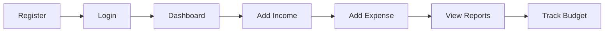
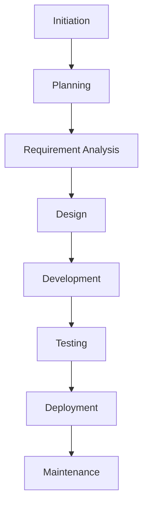

# 📱 Expense Tracker Mobile App

> **Master Project Documentation**

---

# 📑 Table of Contents

* Project Overview
* Business Problem
* Project Vision
* Objectives
* Scope
* Stakeholders
* Functional Requirements
* Non-Functional Requirements
* User Journey
* Project Deliverables
* Project Timeline
* SDLC Approach
* Agile Methodology
* Risk Management
* Testing Strategy
* Success Metrics
* Future Enhancements
* Lessons Learned
* Conclusion

---

# 📖 Project Overview

The **Expense Tracker Mobile App** is a mobile-based financial management application designed to help users monitor their income, expenses, budgets, and savings through a simple and intuitive interface.

The project was executed as part of the Project Management Internship to demonstrate the complete Software Development Life Cycle (SDLC) while applying industry-standard project management practices.

Rather than focusing only on application development, this project emphasizes planning, documentation, stakeholder communication, risk management, Agile execution, testing, and project closure.

---

# 💡 Business Problem

Many individuals struggle to keep track of their daily expenses because they rely on manual methods or scattered financial records.

Common challenges include:

* Forgetting daily expenses
* Lack of spending visibility
* Difficulty creating monthly budgets
* Poor financial planning
* No centralized expense history

These challenges often lead to overspending and poor financial decision-making.

---

# 🎯 Project Vision

To provide users with a simple, secure, and user-friendly mobile application that enables them to efficiently manage their personal finances by recording expenses, monitoring budgets, and generating insightful financial reports.

---

# 🎯 Project Objectives

The primary objectives of the project are:

* Develop a centralized expense management system.
* Improve personal financial awareness.
* Simplify expense recording.
* Provide meaningful spending insights.
* Support better budgeting decisions.
* Deliver a high-quality, user-friendly mobile experience.

---

# 📌 Project Scope

## Included

* User Registration
* User Login
* Dashboard
* Income Management
* Expense Management
* Categories
* Monthly Reports
* Budget Tracking
* Profile Management
* Secure Authentication

## Excluded

* Online Banking Integration
* Cryptocurrency Tracking
* Investment Portfolio Management
* Tax Filing
* Multi-Currency Accounting
* Business Accounting Features

---

# 👥 Stakeholders

| Stakeholder      | Responsibility                    |
| ---------------- | --------------------------------- |
| Project Sponsor  | Funding and approvals             |
| Project Manager  | Project planning and execution    |
| Product Manager  | Product vision and prioritization |
| Development Team | Application development           |
| QA Team          | Testing and quality assurance     |
| End Users        | Product usage and feedback        |

---

# ⚙ Functional Requirements

The application should allow users to:

* Register an account
* Login securely
* Add income
* Add expenses
* Edit transactions
* Delete transactions
* Categorize expenses
* Search transaction history
* Generate monthly reports
* Track budgets
* View spending analytics
* Update profile details

---

# 🔒 Non-Functional Requirements

| Category        | Requirement               |
| --------------- | ------------------------- |
| Performance     | Fast application response |
| Reliability     | High system availability  |
| Security        | Secure authentication     |
| Scalability     | Support increasing users  |
| Maintainability | Modular architecture      |
| Usability       | Simple user interface     |
| Compatibility   | Android & iOS support     |

---

# 👤 User Journey

---

# 🏗 High-Level System Modules

## Authentication Module

* Registration
* Login
* Password Management

---

## Dashboard Module

Displays:

* Total Income
* Total Expenses
* Remaining Budget
* Recent Transactions

---

## Expense Module

Supports:

* Add Expense
* Edit Expense
* Delete Expense
* Expense Categories

---

## Income Module

Supports:

* Add Income
* Edit Income
* Income History

---

## Reports Module

Provides:

* Monthly Reports
* Category Reports
* Spending Charts
* Financial Summary

---

## Profile Module

Supports:

* User Information
* Password Update
* Account Settings

---

# 📦 Project Deliverables

The project includes the following documentation:

* Project Charter
* Stakeholder Register
* Business Requirements Document
* Product Requirements Document
* Work Breakdown Structure
* Project Plan
* Risk Register
* RAID Log
* Change Request Log
* Meeting Minutes
* Weekly Status Reports
* Test Plan
* Test Cases
* User Acceptance Testing Report
* Project Closure Summary

---

# 📅 Project Timeline

| Phase                | Status      |
| -------------------- | ----------- |
| Project Initiation   | ✅ Completed |
| Planning             | ✅ Completed |
| Requirement Analysis | ✅ Completed |
| Documentation        | ✅ Completed |
| Sprint Planning      | ✅ Completed |
| Testing              | ✅ Completed |
| Closure              | ✅ Completed |

---

# 🔄 Software Development Life Cycle

---

# 🚀 Agile Methodology

The project follows Agile principles with iterative planning and continuous stakeholder feedback.

Major Agile activities include:

* Product Backlog
* Sprint Planning
* Daily Stand-ups
* Sprint Reviews
* Sprint Retrospectives

---

# ⚠ Risk Management

Potential project risks included:

| Risk                 | Mitigation               |
| -------------------- | ------------------------ |
| Requirement Changes  | Change Request Process   |
| Schedule Delays      | Weekly Progress Tracking |
| Resource Constraints | Prioritization           |
| Communication Issues | Regular Meetings         |
| Testing Delays       | Early Test Planning      |

---

# 🧪 Testing Strategy

Testing activities included:

* Functional Testing
* Integration Testing
* System Testing
* User Acceptance Testing

Key objectives:

* Validate business requirements
* Identify defects
* Ensure application stability
* Verify user workflows

---

# 📊 Success Metrics

Project success is measured by:

* Completion of planned deliverables
* Stakeholder approval
* Successful testing
* Documentation quality
* Timely project completion

---

# 📈 Future Enhancements

Potential future improvements include:

* Cloud Backup
* OCR Receipt Scanning
* AI Expense Prediction
* Voice Input
* Bill Payment Reminders
* Multi-Currency Support
* Investment Tracking
* Smart Budget Recommendations

---

# 📚 Lessons Learned

Throughout the project, several valuable lessons were gained:

* Early planning reduces project risks.
* Clear documentation improves team collaboration.
* Continuous stakeholder communication prevents misunderstandings.
* Agile practices enable better adaptability.
* Regular testing improves software quality.
* Structured project closure captures valuable organizational knowledge.

---

# 🎯 Project Outcome

The Expense Tracker Mobile App project successfully demonstrated the complete project management lifecycle, from initiation to closure.

All planned documentation was prepared, project objectives were achieved, stakeholders were engaged throughout the lifecycle, and the project concluded with comprehensive testing and formal closure.

This project serves as a practical demonstration of professional project management practices and showcases the ability to manage software projects using industry-standard methodologies.

---

# 👨‍💻 Project Manager

**Dhruv Gupta**

Project Management Intern

---

# 📌 Conclusion

The Expense Tracker Mobile App project represents a complete end-to-end software project management case study. It combines business analysis, planning, Agile execution, documentation, testing, risk management, and project closure into a structured and professional project portfolio that reflects industry best practices.
