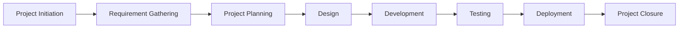

# 💰 Expense Tracker Mobile App

<p align="center">


</p>

---

# 📖 Project Overview

The **Expense Tracker Mobile App** is a project developed as part of the Project Management Internship to demonstrate the complete Software Development Life Cycle (SDLC) from project initiation to project closure.

The application is designed to help users record, organize, and monitor their daily expenses while providing meaningful financial insights through reports and visual analytics. The project emphasizes not only the product itself but also the complete set of project management deliverables required to successfully manage a software project.

---

# 🎯 Project Objectives

The main objectives of this project are:

* Develop a centralized expense tracking solution.
* Enable users to manage income and expenses efficiently.
* Provide real-time expense summaries.
* Generate monthly and category-wise reports.
* Improve personal financial planning.
* Demonstrate professional project management practices.

---

# 👥 Project Information

| Attribute           | Details                    |
| ------------------- | -------------------------- |
| **Project Name**    | Expense Tracker Mobile App |
| **Project Type**    | Mobile Application         |
| **Methodology**     | Agile Scrum                |
| **Project Status**  | Completed                  |
| **Project Manager** | Dhruv Gupta                |
| **Duration**        | June 2026 – July 2026      |

---

# 🚀 Key Features

The application includes the following major features:

* User Registration & Login
* Dashboard Overview
* Add Income
* Add Expenses
* Expense Categories
* Transaction History
* Monthly Reports
* Budget Tracking
* Data Visualization
* Profile Management
* Secure Data Storage

---

# 📂 Project Documentation

This repository contains all major project management documents created during the project lifecycle.

| Document                             | Description                                                                    |
| ------------------------------------ | ------------------------------------------------------------------------------ |
| Project Charter                      | Defines project vision, objectives, scope, stakeholders, and success criteria. |
| Stakeholder Register                 | Identifies project stakeholders and communication needs.                       |
| Business Requirements Document (BRD) | Captures business goals, requirements, and project justification.              |
| Product Requirements Document (PRD)  | Defines detailed functional and non-functional requirements.                   |
| Work Breakdown Structure (WBS)       | Breaks the project into manageable work packages.                              |
| Project Plan                         | Describes schedule, milestones, resources, and timelines.                      |
| Risk Register                        | Identifies project risks and mitigation strategies.                            |
| RAID Log                             | Tracks Risks, Assumptions, Issues, and Dependencies.                           |
| Change Request Log                   | Records requested project changes and approvals.                               |
| Meeting Minutes                      | Documents stakeholder discussions and decisions.                               |
| Weekly Status Reports                | Tracks project progress throughout execution.                                  |
| Test Plan                            | Defines testing strategy and scope.                                            |
| Test Cases                           | Validates application functionality.                                           |
| User Acceptance Testing (UAT)        | Confirms business requirements are satisfied.                                  |
| Project Closure Report               | Summarizes project completion and lessons learned.                             |

---

# 🏗 Project Lifecycle



---

# 📅 High-Level Timeline

| Phase                | Status      |
| -------------------- | ----------- |
| Project Initiation   | ✅ Completed |
| Requirement Analysis | ✅ Completed |
| Planning             | ✅ Completed |
| Documentation        | ✅ Completed |
| Sprint Planning      | ✅ Completed |
| Development Support  | ✅ Completed |
| Testing              | ✅ Completed |
| Project Closure      | ✅ Completed |

---

# 📊 Project Deliverables

* ✅ Project Charter
* ✅ Stakeholder Register
* ✅ Business Requirements Document
* ✅ Product Requirements Document
* ✅ Project Plan
* ✅ Work Breakdown Structure
* ✅ Risk Register
* ✅ RAID Log
* ✅ Change Request Log
* ✅ Meeting Minutes
* ✅ Weekly Status Reports
* ✅ Test Plan
* ✅ Test Cases
* ✅ User Acceptance Testing Report
* ✅ Project Closure Summary

---

# 📈 Success Criteria

The project is considered successful when:

* All planned deliverables are completed.
* Business requirements are documented and approved.
* Project documentation follows professional standards.
* Risks are effectively managed.
* Stakeholders approve the final deliverables.
* Testing confirms that all critical requirements are met.

---

# 🛠 Project Management Skills Demonstrated

* Project Initiation
* Requirement Gathering
* Stakeholder Management
* Agile Scrum
* Sprint Planning
* Work Breakdown Structure (WBS)
* Schedule Management
* Risk Management
* Change Management
* Documentation Management
* Testing Coordination
* Status Reporting
* Project Closure

---

# 📁 Repository Structure

```text
Expense_Tracker_App/
│
├── README.md
├── EXPENSE_TRACKER_APP.md
├── Project Charter
├── Stakeholder Register
├── Business Requirements Document
├── Product Requirements Document
├── Work Breakdown Structure
├── Project Plan
├── Risk Register
├── RAID Log
├── Change Requests
├── Meeting Minutes
├── Weekly Status Reports
├── Test Plan
├── Test Cases
├── UAT Report
└── Project Closure Summary
```

---

# 📚 Learning Outcomes

This project provided practical experience in:

* Managing software projects using Agile methodologies.
* Preparing professional project documentation.
* Coordinating stakeholders and project communication.
* Planning schedules, milestones, and deliverables.
* Managing risks and project changes.
* Conducting testing and project closure activities.

---

# 🎯 Future Enhancements

Potential improvements for future versions include:

* Cloud synchronization
* Multi-device support
* AI-powered expense categorization
* Bill payment reminders
* Investment tracking
* OCR-based receipt scanning
* Export reports in PDF and Excel formats
* Advanced budgeting and forecasting

---

# 👨‍💻 Project Manager

**Dhruv Gupta**

Project Management Intern

---

# 📌 Final Note

This repository demonstrates the complete project management lifecycle for the Expense Tracker Mobile App. It serves as a professional portfolio showcasing planning, documentation, execution, monitoring, testing, and project closure using industry-standard practices.
