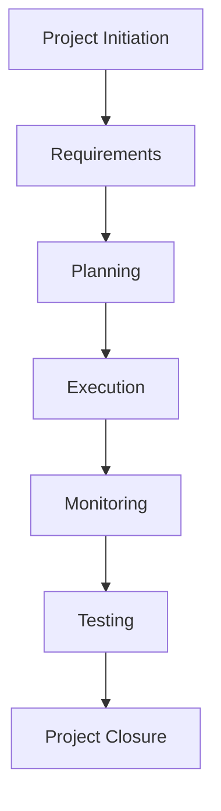
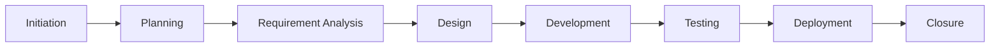

# 📚 Expense Tracker Mobile App – Project Index

> **Master Documentation Index**

---

# 📖 Overview

This document serves as the master index for the **Expense Tracker Mobile App** project documentation package.

It provides a structured overview of every document produced during the project lifecycle, allowing reviewers and stakeholders to quickly locate project artifacts and understand their purpose.

The project follows the Software Development Life Cycle (SDLC) and Agile project management methodology, covering every phase from project initiation through successful project closure.

---

# 📌 Project Information

| Attribute            | Details                    |
| -------------------- | -------------------------- |
| **Project Name**     | Expense Tracker Mobile App |
| **Project Type**     | Mobile Application         |
| **Methodology**      | Agile Scrum                |
| **Project Manager**  | Dhruv Gupta                |
| **Project Duration** | June 2026 – July 2026      |
| **Project Status**   | ✅ Successfully Completed   |
| **Current Version**  | 1.0                        |

---

# 🗂 Documentation Roadmap

---

# 📂 Document Inventory

## 1. Project Initiation

| Document             | Description                                                                             | Status |
| -------------------- | --------------------------------------------------------------------------------------- | ------ |
| Project Charter      | Defines project purpose, objectives, scope, stakeholders, budget, and success criteria. | ✅      |
| Stakeholder Register | Lists stakeholders, roles, influence, communication preferences, and expectations.      | ✅      |

---

## 2. Requirements Management

| Document                             | Description                                                                                                           | Status |
| ------------------------------------ | --------------------------------------------------------------------------------------------------------------------- | ------ |
| Business Requirements Document (BRD) | Captures business goals, business needs, scope, assumptions, constraints, and high-level requirements.                | ✅      |
| Product Requirements Document (PRD)  | Defines detailed functional and non-functional requirements, user stories, acceptance criteria, and product features. | ✅      |

---

## 3. Project Planning

| Document                       | Description                                                                   | Status |
| ------------------------------ | ----------------------------------------------------------------------------- | ------ |
| Work Breakdown Structure (WBS) | Breaks the project into manageable work packages and tasks.                   | ✅      |
| Project Plan                   | Defines project schedule, milestones, deliverables, resources, and timelines. | ✅      |

---

## 4. Project Execution

| Document                  | Description                                                           | Status |
| ------------------------- | --------------------------------------------------------------------- | ------ |
| Meeting Minutes           | Records important meetings, discussions, decisions, and action items. | ✅      |
| Sprint Planning Documents | Defines sprint goals, backlog items, and sprint commitments.          | ✅      |
| Sprint Review Notes       | Documents sprint outcomes and completed work.                         | ✅      |
| Sprint Retrospectives     | Captures lessons learned and process improvements.                    | ✅      |

---

## 5. Monitoring & Control

| Document              | Description                                          | Status |
| --------------------- | ---------------------------------------------------- | ------ |
| Weekly Status Reports | Tracks weekly project progress and milestones.       | ✅      |
| Risk Register         | Identifies project risks and mitigation plans.       | ✅      |
| RAID Log              | Tracks Risks, Assumptions, Issues, and Dependencies. | ✅      |
| Change Request Log    | Documents requested and approved project changes.    | ✅      |

---

## 6. Quality Assurance

| Document                             | Description                                                        | Status |
| ------------------------------------ | ------------------------------------------------------------------ | ------ |
| Test Plan                            | Defines testing objectives, scope, strategy, and responsibilities. | ✅      |
| Test Cases                           | Lists scenarios used to validate application functionality.        | ✅      |
| User Acceptance Testing (UAT) Report | Confirms business requirements have been successfully validated.   | ✅      |

---

## 7. Project Closure

| Document                | Description                                                                               | Status |
| ----------------------- | ----------------------------------------------------------------------------------------- | ------ |
| Project Closure Summary | Officially closes the project, summarizes outcomes, lessons learned, and final approvals. | ✅      |

---

# 📊 Documentation Coverage

| Knowledge Area           | Coverage   |
| ------------------------ | ---------- |
| Project Initiation       | ✅ Complete |
| Scope Management         | ✅ Complete |
| Requirements Management  | ✅ Complete |
| Schedule Management      | ✅ Complete |
| Stakeholder Management   | ✅ Complete |
| Communication Management | ✅ Complete |
| Risk Management          | ✅ Complete |
| Change Management        | ✅ Complete |
| Quality Management       | ✅ Complete |
| Testing                  | ✅ Complete |
| Project Closure          | ✅ Complete |

---

# 🚀 Software Development Life Cycle

---

# 📈 Deliverables Summary

| Deliverable             | Completion Status |
| ----------------------- | ----------------- |
| Project Charter         | ✅ Completed       |
| Stakeholder Register    | ✅ Completed       |
| BRD                     | ✅ Completed       |
| PRD                     | ✅ Completed       |
| WBS                     | ✅ Completed       |
| Project Plan            | ✅ Completed       |
| Risk Register           | ✅ Completed       |
| RAID Log                | ✅ Completed       |
| Change Request Log      | ✅ Completed       |
| Meeting Minutes         | ✅ Completed       |
| Weekly Status Reports   | ✅ Completed       |
| Test Plan               | ✅ Completed       |
| Test Cases              | ✅ Completed       |
| UAT Report              | ✅ Completed       |
| Project Closure Summary | ✅ Completed       |

---

# 🏆 Project Achievements

The project successfully demonstrated:

* End-to-end project management lifecycle execution.
* Professional project documentation aligned with industry standards.
* Agile Scrum implementation.
* Comprehensive risk and issue management.
* Effective stakeholder communication.
* Structured testing and validation.
* Formal project closure with documented lessons learned.

---

# 📚 Lessons Learned

Throughout the project, several key lessons were identified:

* Early planning improves project predictability.
* Well-defined requirements reduce project changes.
* Continuous stakeholder engagement improves project outcomes.
* Agile methodologies increase adaptability.
* Regular risk monitoring prevents major project delays.
* Comprehensive documentation simplifies project governance and future maintenance.

---

# 🎯 Intended Audience

This documentation package is intended for:

* Project Sponsors
* Product Owners
* Project Managers
* Business Analysts
* Development Teams
* QA Engineers
* Academic Reviewers
* Internship Evaluators

---

# 📋 Version History

| Version | Date      | Description                                                    | Author      |
| ------- | --------- | -------------------------------------------------------------- | ----------- |
| 1.0     | July 2026 | Initial release of the complete project documentation package. | Dhruv Gupta |

---

# 👨‍💻 Prepared By

**Dhruv Gupta**
Project Management Intern

---

# 📌 Conclusion

The **Expense Tracker Mobile App Project Documentation Package** represents the successful completion of a full software project management lifecycle. It includes every essential deliverable—from project initiation and requirements gathering to planning, execution, monitoring, testing, and closure—following Agile best practices and professional documentation standards.

This index serves as the central navigation guide for the entire documentation package, enabling stakeholders and reviewers to efficiently access and understand every project artifact.
