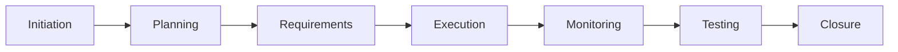

# 📦 Expense Tracker Project Package

---

# 📖 Package Overview

Welcome to the **Expense Tracker Mobile App – Final Project Package**.

This package contains the complete set of project management deliverables created during the Project Management Internship. It demonstrates how a software project progresses through every phase of the Software Development Life Cycle (SDLC), from project initiation to successful closure.

The package has been organized to provide reviewers, mentors, and stakeholders with a structured view of the project documentation, ensuring every important artifact is easy to locate and understand.

---

# 🎯 Purpose of this Package

The objective of this package is to:

* Present all project documents in one location.
* Demonstrate professional project management practices.
* Showcase project planning and execution.
* Provide evidence of project completion.
* Serve as a portfolio for future reference.

---

# 📂 Package Contents

The package includes documentation from every major phase of the project lifecycle.

| Phase              | Documents Included                      |
| ------------------ | --------------------------------------- |
| Project Initiation | Project Charter, Stakeholder Register   |
| Requirements       | BRD, PRD                                |
| Planning           | WBS, Project Plan                       |
| Execution          | Sprint Documents, Meeting Minutes       |
| Monitoring         | Status Reports, RAID Log, Risk Register |
| Change Management  | Change Requests                         |
| Quality Assurance  | Test Plan, Test Cases, UAT Report       |
| Closure            | Project Closure Summary                 |

---

# 📋 Documentation Summary

| Document                | Purpose                                             |
| ----------------------- | --------------------------------------------------- |
| Project Charter         | Defines project goals and scope                     |
| Stakeholder Register    | Identifies project stakeholders                     |
| BRD                     | Captures business requirements                      |
| PRD                     | Defines product functionality                       |
| WBS                     | Breaks work into manageable tasks                   |
| Project Plan            | Defines schedule and milestones                     |
| Risk Register           | Tracks project risks                                |
| RAID Log                | Manages Risks, Assumptions, Issues and Dependencies |
| Change Requests         | Documents approved changes                          |
| Meeting Minutes         | Records important project discussions               |
| Status Reports          | Tracks weekly project progress                      |
| Test Plan               | Defines testing strategy                            |
| Test Cases              | Validates project functionality                     |
| UAT Report              | Confirms business acceptance                        |
| Project Closure Summary | Officially closes the project                       |

---

# 🔄 Project Lifecycle

---

# 📊 Project Status

| Activity          | Status      |
| ----------------- | ----------- |
| Documentation     | ✅ Completed |
| Planning          | ✅ Completed |
| Risk Management   | ✅ Completed |
| Sprint Activities | ✅ Completed |
| Testing           | ✅ Completed |
| Final Review      | ✅ Completed |
| Project Closure   | ✅ Completed |

---

# 🛠 Skills Demonstrated

Throughout this project, the following project management competencies were applied:

* Project Planning
* Business Analysis
* Stakeholder Management
* Agile Scrum
* Sprint Planning
* Documentation Management
* Risk Management
* Change Management
* Communication Management
* Quality Assurance
* Project Monitoring
* Project Closure

---

# 📈 Key Deliverables

* ✅ Complete Project Documentation
* ✅ Business Analysis Documents
* ✅ Planning Documents
* ✅ Risk Management Documents
* ✅ Agile Sprint Documentation
* ✅ Testing Documentation
* ✅ Project Closure Documentation

---

# 📚 Learning Outcomes

This project strengthened practical knowledge in:

* Software Development Life Cycle (SDLC)
* Agile Project Management
* Scrum Framework
* Requirement Gathering
* Professional Documentation
* Stakeholder Communication
* Risk Identification
* Project Monitoring
* Quality Management
* Final Project Delivery

---

# 👨‍💻 Project Manager

**Dhruv Gupta**

Project Management Intern

---

# 📌 Final Note

This package represents the successful completion of the **Expense Tracker Mobile App** project and demonstrates the complete application of professional project management methodologies, documentation standards, and Agile practices. It serves as a comprehensive portfolio showcasing the planning, execution, monitoring, testing, and closure of a real-world software project.
