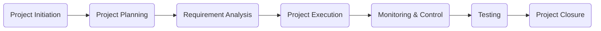

# 🚀 PM Internship Training Period Portfolio – Dhruv Gupta

<p align="center">


</p>

---

# 📖 Overview

This repository contains all the work completed during my **Project Management Internship Training**. It demonstrates my understanding of the complete Software Development Life Cycle (SDLC), Agile project management practices, stakeholder communication, documentation standards, sprint planning, risk management, testing, and project closure.

The repository also includes a complete case study of an **Expense Tracker Mobile Application**, where every major project management document was created from project initiation through successful closure.

---

# 🎯 Internship Objectives

Throughout this internship, the focus was to learn and apply practical project management concepts used in real software development projects.

Key learning areas include:

* Project Initiation
* Stakeholder Management
* Business Analysis
* Requirement Gathering
* Agile & Scrum
* Sprint Planning
* Risk Management
* Change Management
* Meeting Management
* Project Status Reporting
* Documentation Standards
* Testing Documentation
* Project Closure

---

# 📂 Repository Structure

```text
📦 PM-Internship
│
├── 📁 Documents
│   ├── Day 01 – Day 20 Learning Material
│   ├── BRD & PRD References
│   └── PM Templates
│
├── 📁 Expense_Tracker_App
│   ├── Project Documentation
│   ├── Charter
│   ├── BRD
│   ├── PRD
│   ├── Project Plan
│   ├── Risk Register
│   ├── RAID Log
│   ├── Meeting Minutes
│   ├── Status Reports
│   ├── Test Documents
│   └── Final Deliverables
│
└── 📁 Expense_Tracker_Package
    ├── Final Submission Package
    ├── Project Index
    └── Supporting Documents
```

---

# 📚 Learning Journey

| Day    | Topic                                             |
| ------ | ------------------------------------------------- |
| Day 01 | Role of a Project Manager                         |
| Day 02 | Project Understanding & Stakeholder Communication |
| Day 03 | Business Requirements Document (BRD)              |
| Day 04 | Product Requirements Document (PRD)               |
| Day 05 | Git & GitHub for Project Managers                 |
| Day 06 | Jira Project Tracking & Backlog Management        |
| Day 07 | Scrum Framework                                   |
| Day 08 | Sprint Planning                                   |
| Day 09 | Daily Standups & Sprint Tracking                  |
| Day 10 | Sprint Review & Retrospective                     |
| Day 11 | Minutes of Meeting (MoM)                          |
| Day 12 | Project Planning                                  |
| Day 13 | Change Request Management                         |
| Day 14 | Prompt Engineering for PMs                        |
| Day 15 | Status Reporting & RAID Log                       |
| Day 16 | Documentation Standards & Version Control         |
| Day 17 | End-to-End Sprint Simulation                      |
| Day 18 | Escalation Management                             |
| Day 19 | Project Package Creation                          |
| Day 20 | Final Presentaion and Personal Reflection         |

---

# 📁 Featured Project

## 💰 Expense Tracker Mobile App

The primary project completed during this internship Training was the **Expense Tracker Mobile App**.

The project demonstrates how project management practices are applied throughout the lifecycle of a software product.

### Documentation includes

* ✅ Project Charter
* ✅ Stakeholder Register
* ✅ Business Requirements Document (BRD)
* ✅ Product Requirements Document (PRD)
* ✅ Project Plan
* ✅ Work Breakdown Structure (WBS)
* ✅ Risk Register
* ✅ RAID Log
* ✅ Change Requests
* ✅ Meeting Minutes
* ✅ Weekly Status Reports
* ✅ Test Plan
* ✅ Test Cases
* ✅ User Acceptance Testing (UAT)
* ✅ Project Closure Report

---

# 🔄 Project Lifecycle



---

# 🛠 Skills Demonstrated

* Project Planning
* Business Analysis
* Documentation
* Agile Scrum
* Sprint Planning
* Stakeholder Communication
* Risk Management
* Change Management
* Meeting Facilitation
* Status Reporting
* Testing Coordination
* Project Closure
* JIRA, Confluence

---

# 📊 Repository Highlights

| Category          | Status      |
| ----------------- | ----------- |
| Learning Modules  | ✅ Completed |
| Documentation     | ✅ Completed |
| Agile Activities  | ✅ Completed |
| Sprint Simulation | ✅ Completed |
| Testing Documents | ✅ Completed |
| Final Project     | ✅ Completed |

---

# 🎓 Key Outcomes

During this internship I gained practical experience in:

* Creating professional project documentation
* Managing software project lifecycles
* Applying Agile methodologies
* Communicating with stakeholders
* Planning and tracking project progress
* Identifying and managing project risks
* Handling change requests
* Preparing project closure documentation
* Creating Product packages

---

# 📌 Repository Purpose

This repository serves as a portfolio showcasing my project management knowledge, documentation skills, and practical understanding of software project execution using industry-standard methodologies and templates.

---

# 👨‍💻 Author

**Dhruv Gupta**

Project Management Intern

---

# ⭐ Thank You

Thank you for visiting this repository. Feedback and suggestions are always welcome.